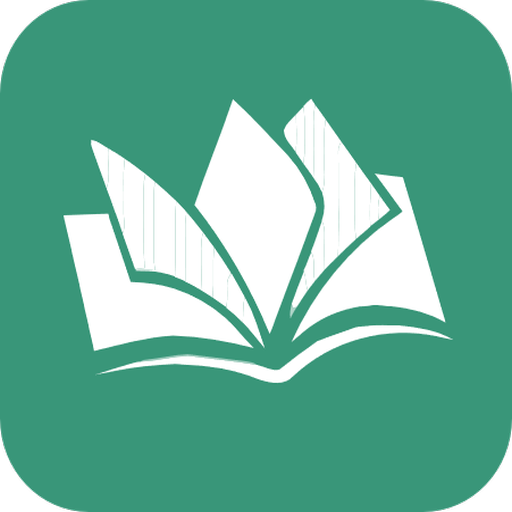

# EDUspark
# 📜 Table of Contents
 - [🚀Intro](#Intro)
 - [📚Main Sections](#Main-Sections)
 - [⚒️Languages & Frameworks & Tools](#Languages-&-Frameworks-&-Tools)
 - [👥Team Members](#Team-Members)
 - [🖼️Project Preview](#Project-Preview)

## 🚀Intro:
Our application primarily connects students (users) with teachers, providing a digital environment that facilitates educational processes for each subject. This includes viewing videos and files, obtaining detailed information and guidance from experts, and allowing users to view specific courses. Users can also manage and control published content, and customize the user experience by following teachers and the teacher's course. We provide a wide range of preferred options, enabling users to always choose the best. Additionally, we enable users to engage in an interactive environment with teachers by completing assignments, earning points, and sharing opinions and ideas with teachers, as well as answering students' questions. We also provide a search and content filtering mechanism within the application to facilitate the user's appropriate presentation based on their specializations and educational interests.

## 📚Main Sections:
### 1-Personalized Data(Fit Application):
- Full support for presenting videos through simple, easy-to-use interfaces, in addition to displaying video information based on the user's interests.
- Providing supporting files(PDF) for these videos to reinforce the concept with the viewer.
- Automatically displaying recent videos relevant to the user's field of expertise upon entering the app.
- Automatically displaying videos, files, and courses relevant to the user's field of expertise upon entering the app.
- Displaying popular videos, files, and courses in their country.
- Advertisements for interactive courses and camps.
### 2-Easy managing (teacher):
- Easily manage, update, and access content on a regular basis, allowing for simple content editing, monitoring, and sorting.
- Ability to upload content (videos, files, etc.) and add it to the app via mobile or laptop (dashboard).
### 3-Super admin:
- Monitor and approve added content.
- Monitor course enrollment and manage courses by tracking the number of participants.
### 4-Category:
- Sort and categorize videos by specialty.
- Access only videos, only files, or both.
- Provide more than one course (with more than one instructor) for the same content.
- Allow users to filter courses by country or specialty.
### 5-Search:
 -Ability to search for content by:
● Course name.
● Content type.
- Save recently searched courses.
### 6-Notifications and alerts:
Notifications and Alerts:
- The app allows users to receive notifications and alerts regarding new content, updates, or upcoming tasks.
- Notifications alert you when the app has been inactive for a long period of time.
### 7-Timer Counter:
- Calculating the time since entering the application and rewarding it with points according to the time spent inside the application.
### 8-Points system:
Points Collection System:
- Allows users to collect points for purchasing books by using the app (spending time within the app).
### 9-Reliability:
Do not display any content to any teacher without the approval of the supervisor.
### 10-Live:
- Teachers can add and schedule live broadcasts.
- View scheduled broadcasts and obtain the link by copying and clicking on it.
### 11-Blog:
- Allows instructors to add posts to advertise courses.
- Users and instructors can comment on the post.
### 12-Chatting:
- The ability to communicate between users, teachers, and users themselves easily by switching to the WhatsApp application.
### 13-Quizzes:
- Teachers can create tests based on their specialization.
- Students can solve tests, with correct questions being counted and displayed, incorrect questions being displayed, and the final score displayed at the end of the test.
- Students can obtain a certificate upon completion of the test.
## ⚒️Languages & Frameworks & Tools:
#### Frameworks:
   -Flutter Framework as front-end
   -Laravel Framework as Back-end
#### Languages:
   -Dart
   -PHP
   -JavaScripte
   -HTML

This project is a starting point for a Flutter application.

A few resources to get you started if this is your first Flutter project:

- [Lab: Write your first Flutter app](https://docs.flutter.dev/get-started/codelab)
- [Cookbook: Useful Flutter samples](https://docs.flutter.dev/cookbook)

For help getting started with Flutter development, view the
[online documentation](https://docs.flutter.dev/), which offers tutorials,
samples, guidance on mobile development, and a full API reference.
